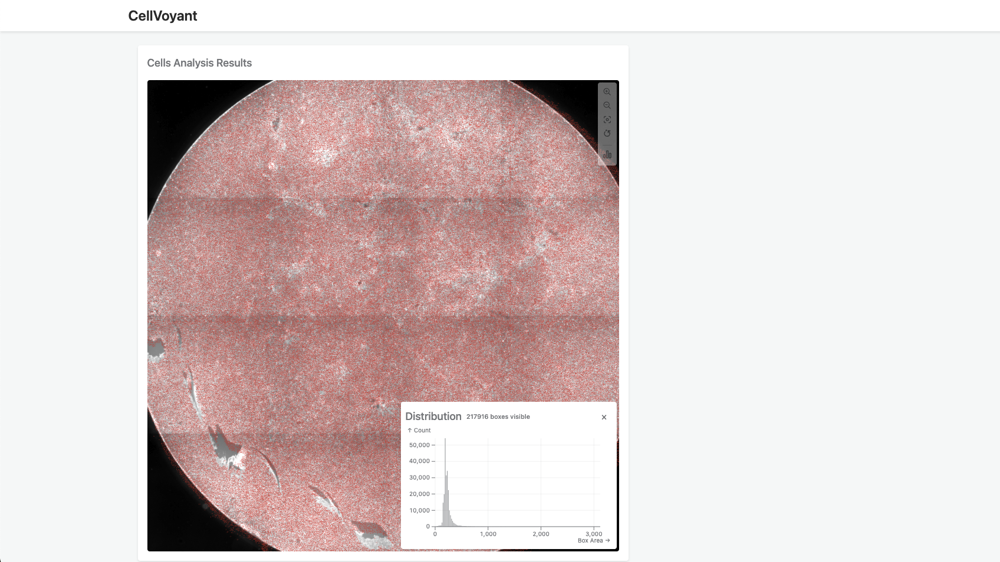

# Interactive Cell Image Viewer with Bounding Box Analysis

A React-based web application for analyzing high-resolution cell images with AI-generated cell marker overlays. This project is designed to provide biologists with a powerful tool for analyzing cell images.



## Table of Contents

- [Interactive Cell Image Viewer with Bounding Box Analysis](#interactive-cell-image-viewer-with-bounding-box-analysis)
  - [Table of Contents](#table-of-contents)
  - [Features](#features)
  - [Technical Approach \& Decision Making](#technical-approach--decision-making)
    - [Initial Technology Selection](#initial-technology-selection)
    - [Performance Optimization Journey](#performance-optimization-journey)
    - [Key Technical Decisions](#key-technical-decisions)
  - [Technology Stack](#technology-stack)
  - [Project Structure Overview](#project-structure-overview)
  - [Nice to Have](#nice-to-have)
    - [Feature side](#feature-side)
    - [Coding side](#coding-side)
  - [Known Issues](#known-issues)
  - [Getting Started](#getting-started)
    - [Prerequisites](#prerequisites)
    - [Installation](#installation)
    - [Available Scripts](#available-scripts)

## Features

- **High-Resolution Image Viewer**

  - Resized and displayed large cell images (up to 8000x8000px)
  - Smooth zooming and panning functionality
  - Skeleton loading state for initial rendering
  - Optional toolbox on the side for viewport interaction

- **Bounding Box Overlay**

  - Display up to 200,000 bounding boxes efficiently on the image
  - Real-time rendering of cell markers
  - Smooth performance while performing viewport interaction
  - Displayed tooltip on hover over the bounding box
  - Displayed hover state on hover over the bounding box

- **Statistical Visualization**
  - Dynamic size distribution chart of bounding boxes
  - Viewport-based filtering
  - Toggleable overlay interface via the toolbox

## Technical Approach & Decision Making

### Initial Technology Selection

- Started with Apache ECharts for its built-in features but faced performance limitations with large datasets
- Evaluated WebGL-based solutions: Pixi.js, Deck.gl, Plotly.js
- Chose Pixi.js for:
  - Strong 2D visualization capabilities
  - High customization potential
  - Web Worker and OffscreenCanvas compatibility
  - Prior development experience

### Performance Optimization Journey

1. **Basic Implementation**

   - Initial Pixi.js setup with basic rendering
   - Implemented Particle Container for improved performance
   - Added pixi-viewport for interaction handling

2. **Advanced Optimizations**

   - Moved to Web Workers + OffscreenCanvas for rendering and data manipulation
   - Created custom mini-viewport for better worker compatibility
   - Implemented RenderTexture for efficient hover state management
   - Used RBush for spatial indexing of points (O(log n) search complexity)
   - Debounced/throttled operations for:
     - Hover detection
     - Viewport updates
     - Distribution chart updates
   - Optimized message passing between threads

### Key Technical Decisions

- **Rendering**: WebGL-based rendering with OffscreenCanvas API for handling 200,000+ data points
- **Spatial Indexing**: R-tree implementation via RBush for efficient point queries
- **Threading**: Web Workers for heavy computations and data processing
- **Update Frequency Control**: Debounced/throttled operations to balance responsiveness and performance
- **Chart Library**: Observable Plot for distribution visualization with D3.js binning

## Technology Stack

- React + TypeScript + Vite
- [PixiJS](https://pixijs.com/)
- [@pixi/webworker](https://www.npmjs.com/package/@pixi/webworker)
- [Observable Plot](https://observablehq.com/plot/)
- [RBush](https://github.com/mourner/rbush)
- ESLint + Prettier

## Project Structure Overview

```
src/
├── components/
├── hooks/
├── workers/
├── utils/
├── types/            # TypeScript type definitions
└── assets/           # Static assets (svg images)
```

## Nice to Have

### Feature side

- Discuss with the user and update the styling of the bounding box
- Loading state indicators for distribution chart during each viewport updates
- Component testing and function unit testing
- Progressive rendering with initial sampling:
  - Start with a subset of points for initial view
  - Load full dataset when user zooms in
  - Optimize rendering based on zoom level
- Enhanced user experience:
  - Resize the viewport on smaller screen
- Data processing optimizations:
  - Implement data compression(Communication between main thread and web worker)
  - Optimize data loading strategy: Move the initial data processing to the worker as well
- Error handling and stability:
  - Add error boundary handling especially on worker-related features
  - Provide better error feedback
- Performance monitoring and analysis:
  - Add performance monitoring tools
  - Track rendering frame rate (FPS)
- Technology evaluation:
  - Consider evaluating Deck.gl as an alternative rendering solution to compare performance and features

### Coding side

- Refactor useViewport and OffscreenViewport class logic to make it easier to manage

## Known Issues

- Firefox users may experience WebGL-related rendering issues

## Getting Started

### Prerequisites

- Node.js (v22.14.0 or higher)
- nvm (Node Version Manager) - recommended for managing Node.js versions
- npm

### Installation

1. Clone the repository:

```bash
git clone https://github.com/smallpaes/Cellvoyant-Data-Visualization-Tool.git
cd Cellvoyant-Data-Visualization-Tool
```

2. Install and use the correct Node.js version:

```bash
# If you have nvm installed, run:
npm run use-node-version

# Or manually install the version specified in .nvmrc
nvm install 22.14.0
nvm use 22.14.0
```

3. Install dependencies:

```bash
npm install
```

4. Start the development server:

```bash
npm run dev
```

5. Open your browser and navigate to `http://localhost:5173`

### Available Scripts

- `npm run dev` - Start the development server
- `npm run lint` - Run ESLint to check for code issues
- `npm run format` - Format code using Prettier
- `npm run use-node-version` - Switch to the correct Node.js version
- `npm run build` - Build the project for production
